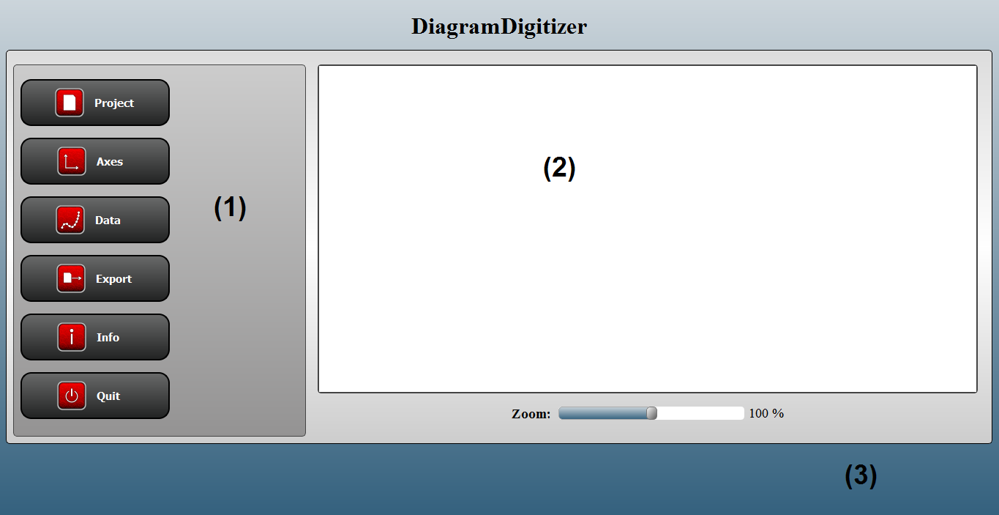
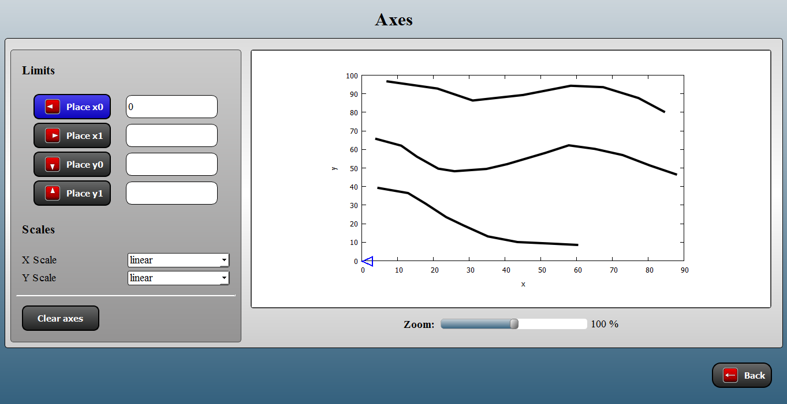
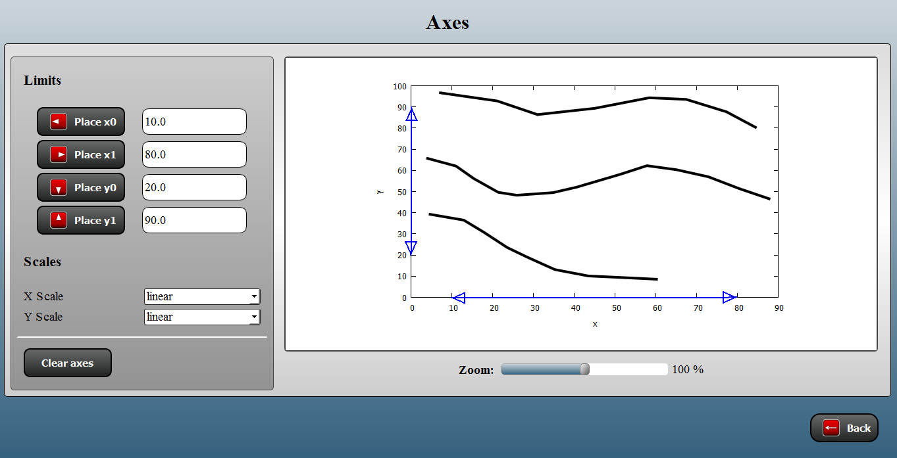
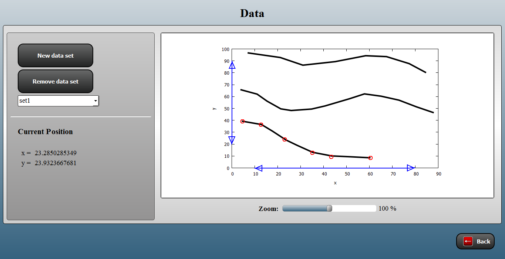
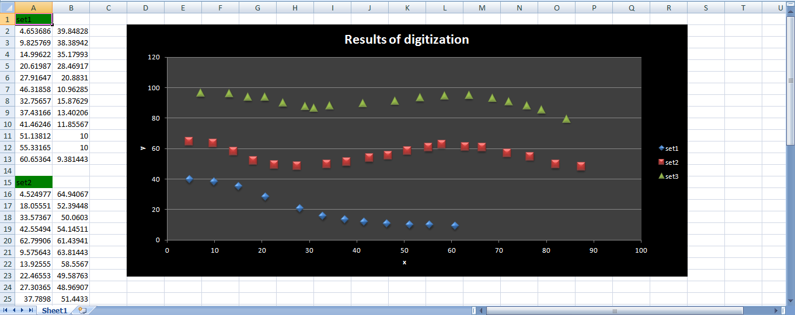

..  -*- coding: utf-8 -*-

Tutorial
========

DiagramDigitizer can be started from Anaconda prompt by

.. code:: bash

    diagramdigitizer

or from Python prompt by

.. code:: python

    >>> import diagramdigitizer
    >>> diagramdigitizer.diagramdigitizer.run()

When starting DiagramDigitizer, the main window is displayed as shown in Figure 1.

    Figure 1: Main window of DiagramDigitizer: Navigation menu (1), digitization area (2),
    and secondary navigation (3). If a submenu has been entered, the secondary navigation
    contains a **Back** button, which allows to reach the navigation menu from the respective
    submenu (see e.g. Figure 2).

It consists of the navigation menu, the digitization area, and the
secondary navigation.

The navigation menu contains the following submenus:

* **Project**: Start a new project, load an existing project from file or save the current project status to a file.
* **Axes**: Define the axes limits (*x0*, *x1*, *y0*, *y1*) as well as axes scales (linear/logarithmic).
* **Data**: Digitize each curve within the diagram.
* **Export**: Process data (ordering, interpolation) and export the numerical data to different file types (Text, CSV, Excel).
* **Info**: Show this documentation.
* **Quit**: Exit DiagramDigitizer.

Navigation within DiagramDigitizer proceeds always via the navigation menu, which can be reached from each submenu using
the **Back** button in the secondary navigation (see e.g. Figure 2).

Project
-------

In this submenu, the user has the following options:

* **New Project**: Start a new project by opening an image file which contains the diagram to be digitized.
* **Load Project**: Load an existing project from file.
* **Save Project**: Save the current project status to a file.

Axes
----

In this submenu, the axes of the diagram can be defined.

Definition of an axis limit (e.g. *x0*) is possible by activating the corresponding button (see Figure 2), entering the
corresponding value and placing the axis limit within the digitization area (containing the diagram) by mouse
using the *left* mouse button. The placed axis limit can be removed using the *right* mouse button. In order to change the
place of an existing axis point, the corresponding button has to activated and the respective new axis point can be
placed using *left* mouse button.

    Figure 2: Submenu Axes of DiagramDigitizer: Defining an axis limit (here: *x0* - the corresponding axis limit button
    is active).

Once the axes definition has been completed, the axes are shown within the diagram (see Figure 3). The axes definition
can be cleared using the **Clear axes** button.

    Figure 3: Submenu Axes of DiagramDigitizer: Completed axes definition.

In addition, the scale of each axes can be set: linear or logarithmic scale.

Data
----

In this submenu, the actual data extraction can be done.

The data is organized in data sets in the same way as a typical diagram contains several curves/lines. In order to
extract data from one curve, add a new data set using the **New data set** button and digitize the curve by
mouse (*left* mouse button). An axis point of the active data set can be removed using the *right* mouse button. The user
can switch between the different sets to add/remove data points or remove a data set (see Figure 4).

    Figure 4: Submenu Data of DiagramDigitizer: data extraction.

The actual coordinates within the diagram are displayed as well in order to support the digitization procedure.

Export
------

In this submenu, the user can export the numerical data to various output
formats (Text, CSV, and Excel) for further use.

Special feature: The Excel sheet additionally contains a chart with the
digitized data points (see Figure 5).

    Figure 5: Excel export.

The data may be processed before export: sorting of data points within each set as well as interpolation of the
data points.